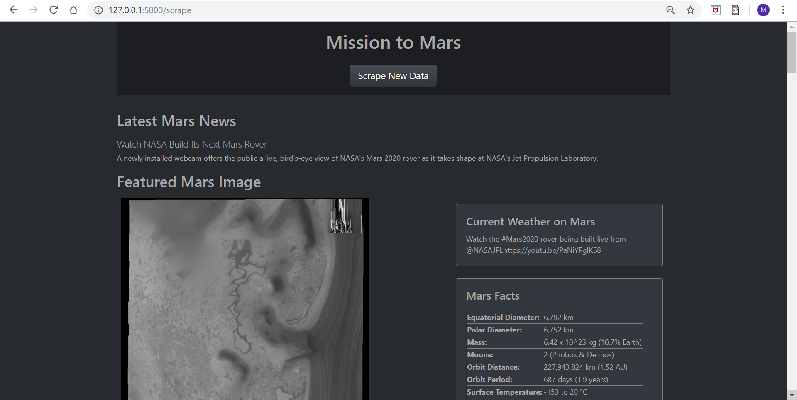

# Mission-to-Mars Web Scraping

In this homework, BeautifulSoup was utilized to scrape data from various web pages that provides Mars latest news, featured images, weather, facts, current tweets, and pulling the data of the four different hemispheres. Then, I stored the data in MongoDB and then loaded it into an HTML file using a Flask that connects with Python. Finally, I formatted the HTML using Bootstrap and configured the "app.py" file to ensure that by clicking the "Scrape" button on the web page, it would re-scrape and eventually render the most up-to-date information on Mars.

## Prerequisites

* Python / Jupyter Notebook
* Pandas
* BeautifulSoup
* Flask
* Splinter / Selenium
* MongoDB
* HTML 5.0
* [Bootstrap](https://getbootstrap.com/)

## Executing the Flask App

Follow these instructions in sequence to launch the application.

1. Open your bash application and start up the mongodb server by typing in and executing the following code:
```bash
$ mongod
```
RESULT: Per the screenshot below, "mars_db" has populated in MongoDB.


2. In Visual Studio Code run the "app.py" python file, right-click and select "Run Python File in Terminal".

```
 * Debug mode: on
 * Restarting with stat
 * Debugger is active!
 * Debugger PIN: 333-445-847
 * Running on http://127.0.0.1:5000/ (Press CTRL+C to quit)
127.0.0.1 - - [06/Jun/2019 21:28:24] "GET / HTTP/1.1" 200 -
```

3. Congrats! The application is running successfully. Now, to view the result, Google browser should open automatically upon clicking on _http://127.0.0.1:5000_. Now, press the __Scrape New Data__ button, you have to wait a few seconds while the application gathers the data before presenting it to you. The webpage should look similar to below __screenshot__ after it is done.




